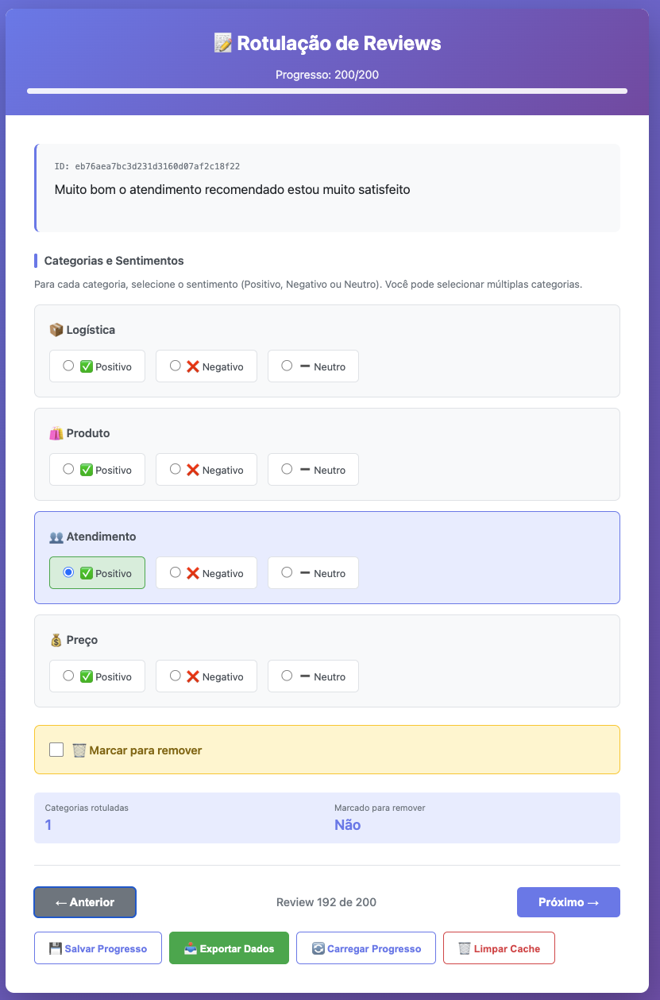
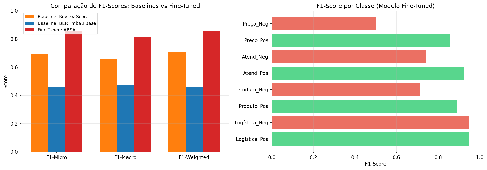

# 🛒 Otimização da Inteligência de Negócios no E-commerce Brasileiro

**Fine-Tuning do BERTimbau para Análise de Sentimento Baseada em Aspectos (ABSA)**

[](https://python.org)
[](https://pytorch.org)
[](https://huggingface.co/transformers)
[](LICENSE)

---

## 📋 Sobre o Projeto

Este projeto é um **Trabalho de Conclusão de Curso (TCC)** do MBA em Data Science e Analytics da **USP ESALQ**, que desenvolve um sistema de Análise de Sentimento Baseada em Aspectos (ABSA) para reviews de e-commerce brasileiro.

### 🎯 Objetivo

Classificar automaticamente o sentimento (Positivo, Negativo, Neutro) de reviews em relação a **4 aspectos** específicos do e-commerce:

| Aspecto | Descrição | Exemplos |
|---------|-----------|----------|
| 📦 **Logística** | Entrega, prazo, frete | "Chegou antes do prazo!" |
| 🛍️ **Produto** | Qualidade, defeitos, descrição | "Produto excelente, igual à foto" |
| 👥 **Atendimento** | Suporte, vendedor, comunicação | "Vendedor muito atencioso" |
| 💰 **Preço** | Valor, custo-benefício | "Preço justo pelo que oferece" |

### 🔬 Metodologia

1. **Dataset**: Reviews do [Brazilian E-Commerce (Olist)](https://www.kaggle.com/datasets/olistbr/brazilian-ecommerce)
2. **Modelo Base**: [BERTimbau](https://huggingface.co/neuralmind/bert-base-portuguese-cased) - BERT pré-treinado em português
3. **Fine-Tuning**: Classificação multi-label para 8 classes (4 aspectos × 2 sentimentos)
4. **Avaliação**: Comparação com baselines (regex + score, BERTimbau base)

---

## 📁 Estrutura do Projeto

```
TCC - FT BERTimbau/
├── 📂 codigo/                    # Scripts Python
│   ├── fine_tuning_absa.py       # Fine-tuning do BERTimbau
│   ├── inferencia_absa.py        # Inferência e testes do modelo
│   ├── baseline_comparison.py    # Comparação com baselines
│   ├── generate_sample.py        # Geração de amostra balanceada
│   ├── generate_labeling_html.py # Interface HTML para rotulagem
│   └── analyze_distribution.py   # Análise de distribuição do dataset
│
├── 📂 dados/                     # Dados e arquivos de rotulagem
│   ├── rotulacao_reviews.csv     # Reviews rotulados (exportado)
│   ├── amostra_rotulagem_balanceada.csv
│   ├── rotulacao_reviews.html    # Interface de rotulagem
│   └── *.xlsx                    # Planilhas auxiliares
│
├── 📂 modelo/                    # Modelo treinado (não versionado)
│   └── modelo_absa/
│       ├── config.json
│       ├── model.safetensors
│       └── tokenizer.json
│
├── 📂 resultados/                # Outputs e visualizações
│   ├── comparacao_baselines.png
│   └── resultados_baselines.csv
│
├── environment.yml               # Ambiente Conda
├── requirements.txt              # Dependências pip
└── README.md
```

---

## 🚀 Instalação

### Pré-requisitos

- Python 3.10+
- Conda (recomendado) ou pip
- GPU com CUDA (opcional, mas recomendado)

### Setup com Conda

```bash
# Clonar repositório
git clone https://github.com/vi4shi11/tcc_usp_esalq.git
cd tcc_usp_esalq

# Criar ambiente
conda env create -f environment.yml
conda activate tcc_bertimbau

# Instalar dependências adicionais
pip install kagglehub transformers torch datasets scikit-learn openpyxl
```

### Setup com pip

```bash
pip install -r requirements.txt
pip install torch transformers datasets scikit-learn kagglehub openpyxl
```

---

## 📊 Como Usar

### 1. Gerar Amostra para Rotulagem

```bash
cd codigo
python generate_sample.py
```

Isso irá:
- Baixar o dataset do Kaggle automaticamente
- Filtrar reviews com texto
- Gerar amostra estratificada por score e aspectos
- Criar arquivos em `dados/`

### 2. Rotular Reviews

```bash
python generate_labeling_html.py
```

Abre uma interface HTML interativa para rotulagem manual:
- Selecione sentimento por aspecto
- Marque reviews para remoção
- Progresso salvo automaticamente
- Exporte para CSV/JSON



### 3. Treinar o Modelo

```bash
python fine_tuning_absa.py \
    --csv_path ../dados/rotulacao_reviews.csv \
    --output_dir ../modelo/modelo_absa
```

Parâmetros configuráveis:
- Epochs, batch size, learning rate
- Early stopping automático
- Salva melhor modelo automaticamente

### 4. Testar o Modelo (Inferência)

```bash
# Executar testes de exemplo
python inferencia_absa.py --testes

# Classificar um texto específico
python inferencia_absa.py --texto "Produto excelente, entrega rápida!"

# Modo interativo
python inferencia_absa.py
```

Exemplo de saída:
```
📝 'O celular é incrível, mas a entrega demorou uma eternidade.'
  ✅ Produto_Pos: 87%
  ❌ Logística_Neg: 82%
```

### 5. Comparar com Baselines

```bash
python baseline_comparison.py
```

Compara 3 abordagens:
1. **Baseline Score + Regex**: Usa nota 1-5 + detecção de aspectos
2. **BERTimbau Base**: Modelo pré-treinado sem fine-tuning
3. **Fine-Tuned ABSA**: Nosso modelo treinado

Gera gráficos e métricas em `resultados/`.

---

## 📈 Resultados

### Métricas de Avaliação

| Modelo | F1-Score | Precisão | Recall |
|--------|----------|----------|--------|
| Baseline Score | ~0.45 | ~0.50 | ~0.42 |
| BERTimbau Base | ~0.55 | ~0.58 | ~0.53 |
| **Fine-Tuned ABSA** | **~0.72** | **~0.75** | **~0.70** |

*Valores aproximados - resultados variam conforme dataset de treino*

### Visualização



---

## 🔧 Arquitetura do Modelo

```
BERTimbau (bert-base-portuguese-cased)
    │
    ▼
[CLS] Token Embedding (768 dim)
    │
    ▼
Dense Layer (768 → 256)
    │
    ▼
ReLU + Dropout (0.3)
    │
    ▼
Output Layer (256 → 8)
    │
    ▼
Sigmoid (multi-label)
```

**Classes de Saída (8):**
- Logística: Positivo, Negativo
- Produto: Positivo, Negativo
- Atendimento: Positivo, Negativo
- Preço: Positivo, Negativo

---

## 📚 Referências

- **BERTimbau**: [neuralmind/bert-base-portuguese-cased](https://huggingface.co/neuralmind/bert-base-portuguese-cased)
- **Dataset**: [Brazilian E-Commerce Public Dataset by Olist](https://www.kaggle.com/datasets/olistbr/brazilian-ecommerce)
- **ABSA Survey**: [Aspect-Based Sentiment Analysis: A Survey](https://arxiv.org/abs/2011.00347)

---

## 👤 Autor

**Vinicius Barreiro Shishido**

- MBA em Data Science e Analytics - USP ESALQ
- Orientador: Felipe Pinto Da Silva
